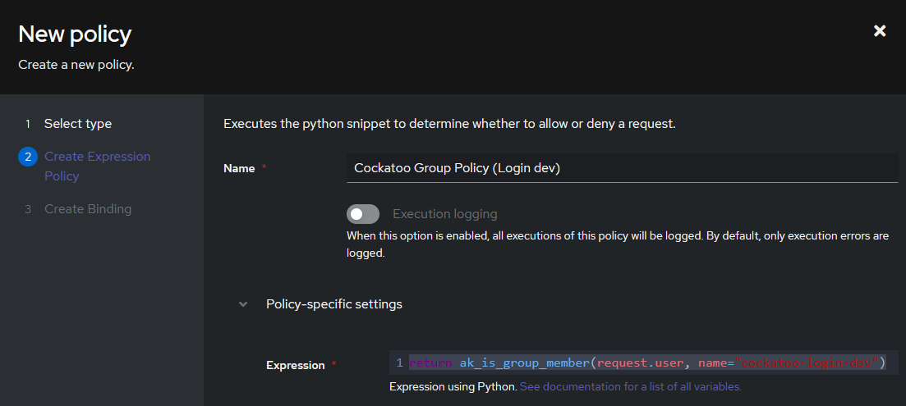

# OAuth Setup with Authentik
If you wish to use Authentik for authentication with Cockatoo, then follow this guide.

Currently, the Github-Compatible endpoints will be used. In the future this will be updated to be compatible with more OIDC-complient authentication providers.

## Initial Setup
Granular permissions are defined inside of Cockatoo, in the [Admin->Groups->Permissions](Admin-Permissions-Groups) or [Admin->Users->Permissions](Admin-Permissions-Users) pages. Authentik will only be used for permitting login.

This guide is assuming that you have a Group created in Authentik already, and that it is assigned to yourself or someone else.

## Provider Setup
When creating the OAuth Provider, use the following steps;
- Select the Type `OAuth2/OpenID Provider`
- Click on the `Next` button.


- Enter something memorable into the `Name` textbox. I'll be putting in `cockatoo-dev`.
- Select `default-provider-authorization-explicit-consent` for the authorization workflow.
- Under `Advanced Protocol Settings`, make sure that `Subject Mode` is set to `Based on the User's hashed ID`.
- Click on `Finish`.


## Application Setup
Once you've created the Provider, go into the Applications listing and create a new one.
- Set the name to whatever you want.
- Set the slug to something memorable, since it will be used in the future if you wish to use OIDC instead of OAuth2 (mocking as Github Enterprise).
- Select the Provider to the one you just created.


After you've done that, you must setup a Policy binding for that application.
- Click on the name of the application you just created (or click on the Edit button)
- Click on the `Policy / Group / User Bindings` tab.
- Click on the button that says `Create & bind Policy`.
- Select the type `Expression Policy` then click on the `Next` button.
- Set the name to something memorable, but unique.
- Set the content of `Expression` to the following (replace `<group name>` with the name of your group)
```python
return ak_is_group_member(request.user, name="<group name>")
```

- Then click on the `Next` button.
- Double-check the name of the Policy, and make sure that `Policy` is selected instead of `Group` or `User`.
- Click on `Finish`.

## Config Setup
In the file that you use for your Environment Variables, make sure that the following is set (but make sure to substitute your own values)
```bash
AUTHENTIK_ENABLE=true
AUTHENTIK_CLIENT_ID=XXXXXXXXXXXXXXX
AUTHENTIK_CLIENT_SECRET=XXXXXXXXXXXXXXX
AUTHENTIK_DOMAIN=auth.example.com
AUTHENTIK_SLUG=application-slug
```

### Notes
- The `AUTHENTIK_CLIENT_ID` and `AUTHENTIK_CLIENT_SECRET` values can be found in your provider when clicking on the `Edit` button.
- In the endpoint environment variables, replace the value of `AUTHENTIK_DOMAIN` with the `domain:port` (port is optional, but has to be HTTPS) of your authentik server, and the `application-slug` with the slug of your application.